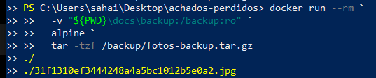
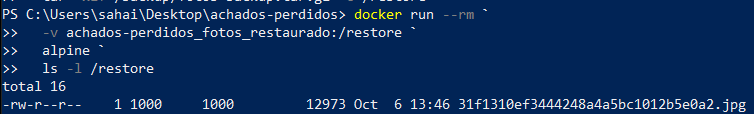

# Backup e restauração do volume de fotos

Foi realizado um backup do volume nomeado `achados-perdidos_fotos`, utilizado pela aplicação para armazenar as fotos em `/app/uploads`.

## Backup

O backup foi criado utilizando um contêiner temporário Alpine:

```powershell
docker run --rm `
  -v achados-perdidos_fotos:/source:ro `
  -v "${PWD}\docs\backup:/backup" `
  alpine `
  tar -czf /backup/fotos-backup.tar.gz -C /source .
  ```

## O conteúdo do arquivo de backup foi conferido com:

```powershell
docker run --rm `
  -v "${PWD}\docs\backup:/backup:ro" `
  alpine `
  tar -tzf /backup/fotos-backup.tar.gz
  ```
**Resultado:** 

  

---

### Restauração

  ```powershell
docker volume create achados-perdidos_fotos_restaurado
  ```

**O backup foi restaurado nesse novo volume:**


  ```powershell
docker run --rm `
  -v achados-perdidos_fotos_restaurado:/restore `
  -v "${PWD}\docs\backup:/backup:ro" `
  alpine `
  tar -xzf /backup/fotos-backup.tar.gz -C /restore
  ```

**A restauração foi verificada com:**
  
    ```powershell
docker run --rm `
  -v achados-perdidos_fotos_restaurado:/restore `
  alpine `
  ls -l /restore
  ```

**Resultado:** 



O resultado confirma que a foto foi recuperada corretamente no novo volume.
Após a verificação, o volume temporário achados-perdidos_fotos_restaurado foi removido.

**Resultado**

O procedimento demonstrou que o volume fotos pode ser convertido em um arquivo de backup .tar.gz e posteriormente restaurado em um novo volume, recuperando os arquivos armazenados