# Evidência 01 — Docker Compose

## Comando

```powershell
docker compose ps
```
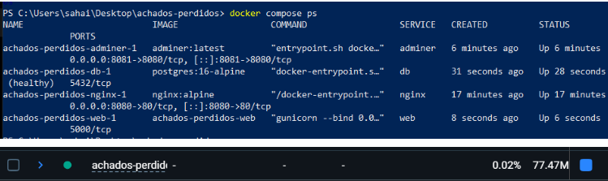

---

# Evidência 02 — Health Check

## Comando

```powershell
curl.exe http://localhost:8080/health
```
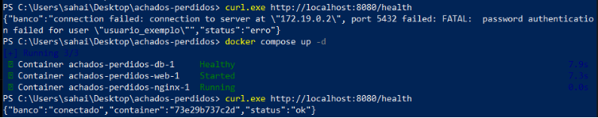

---

# Evidência 03 — Consulta de Itens

## Comando

```powershell
curl.exe http://localhost:8080/itens
```
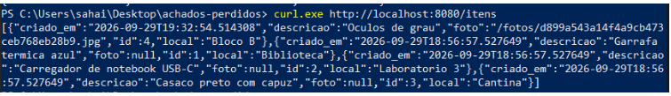

---

# Evidência 04 — Filtro por Local

## Comando

```powershell
curl.exe "http://localhost:8080/itens?local=biblio"
```
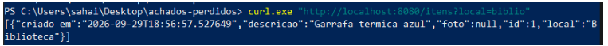

---

# Evidência 05 — Cadastro de Item com Foto

## Comando

```powershell
curl.exe -F "descricao=Oculos de grau" -F "local=Bloco B" -F "foto=@oculos.jpg" http://localhost:8080/itens
```
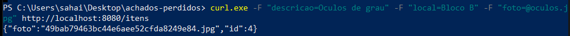

---

# Evidência 06 — Estatísticas

## Comando

```powershell
curl.exe http://localhost:8080/estatisticas
```
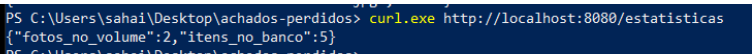

---

# Evidência 07 — Consulta da Foto

## Comando

```powershell
curl.exe -I http://localhost:8080/fotos/<nome-da-foto>
```
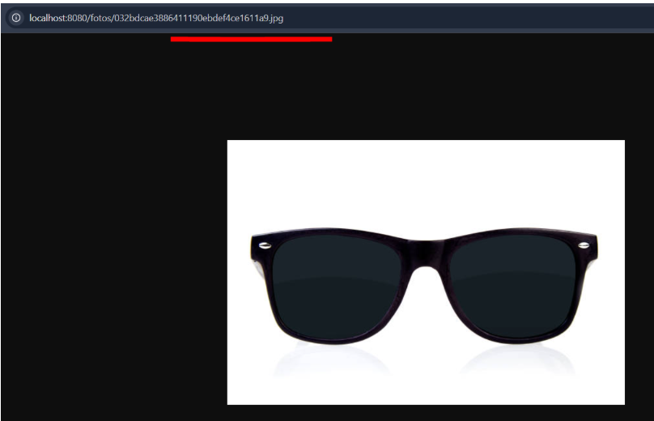

---

# Evidência 08 — Logs da Aplicação

## Comando

```powershell
docker compose logs web
```
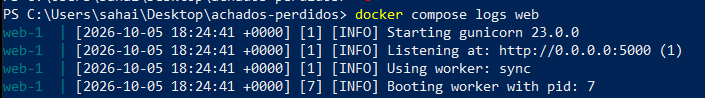

---

# Evidência 09 — Persistência dos Dados

## Comandos

```powershell
docker compose down
docker compose up -d
curl.exe http://localhost:8080/itens
```
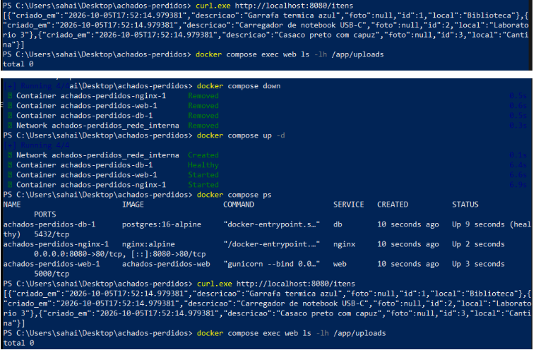

---

# Evidência 10 — Volumes Docker

## Comando

```powershell
docker volume ls
```
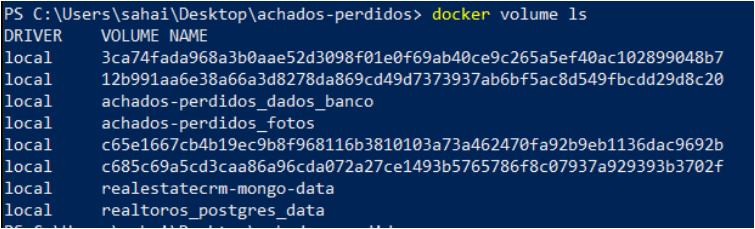

---

# Evidência 11 — Rede Docker

## Comando

```powershell
docker network inspect achados-perdidos_rede_interna
```
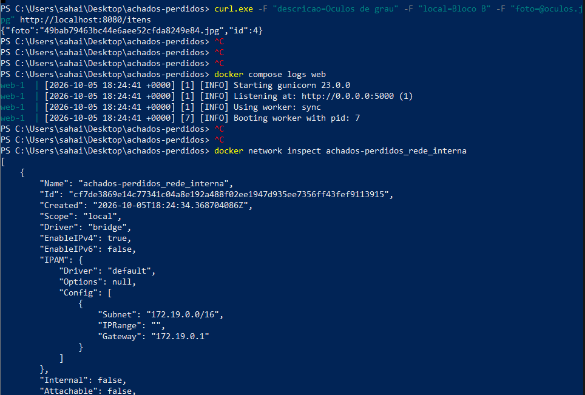

---

# Evidência 12 — Imagem Docker

## Comando

```powershell
docker image ls
```
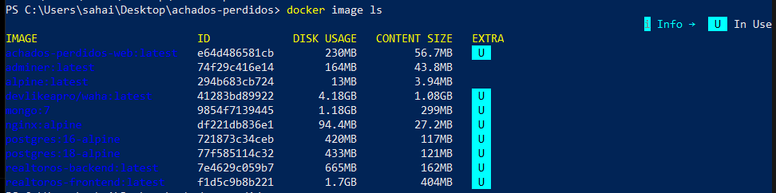

---

# Evidência 13 — Inspeção dos Volumes

## Comandos

```powershell
docker volume inspect achados-perdidos_dados_banco
docker volume inspect achados-perdidos_fotos
```
# Evidência 14 — Conteúdo do Volume de Fotos

## Comando

```powershell
docker compose exec web ls -l /app/uploads
```
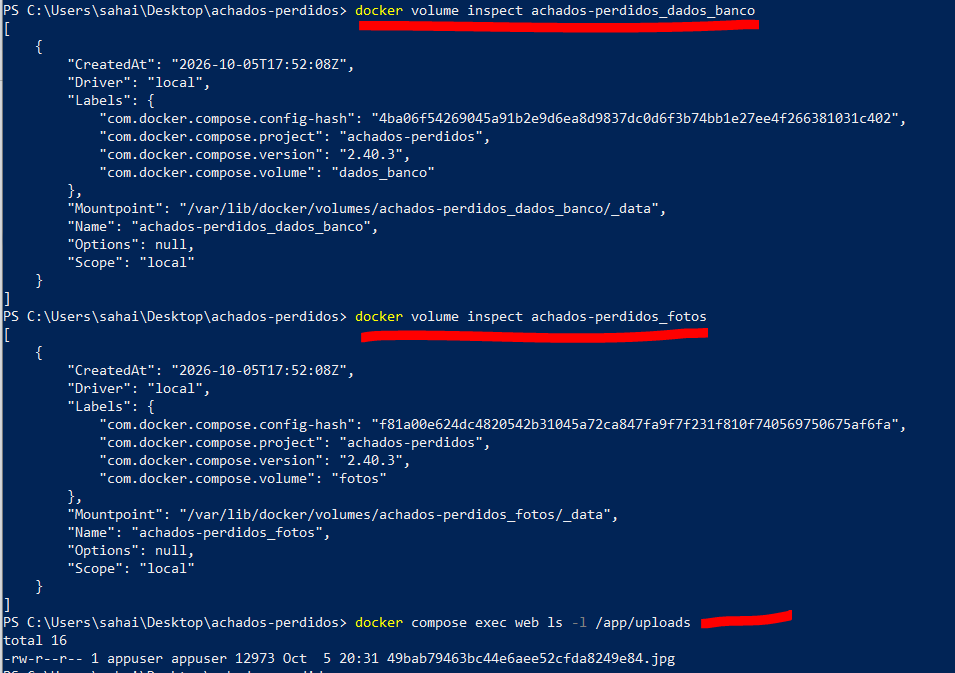

---

# Evidência 15 — Remoção dos Volumes

## Estado antes da remoção

```powershell
curl.exe http://localhost:8080/estatisticas
```
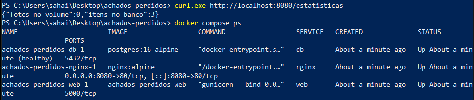

## Remoção e recriação
```powershell
docker compose down -v
docker compose up -d
```
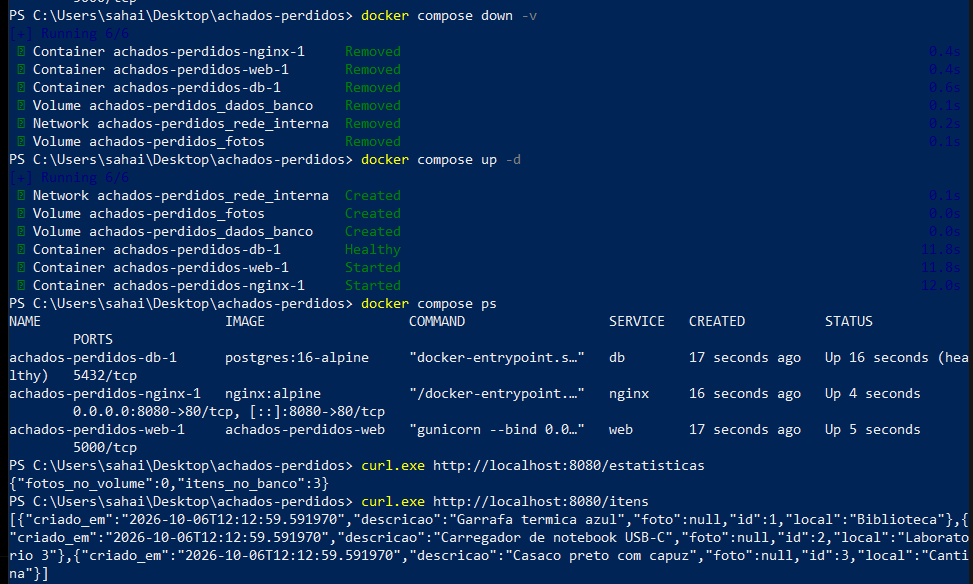